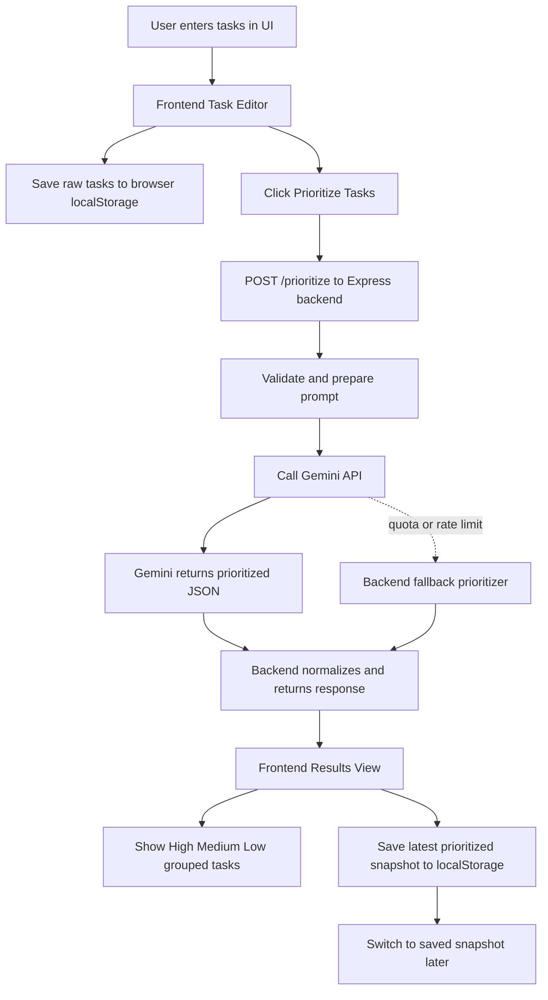
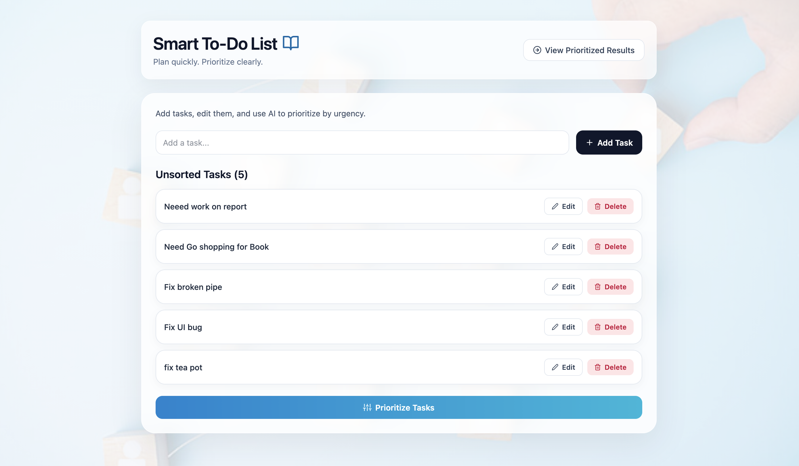
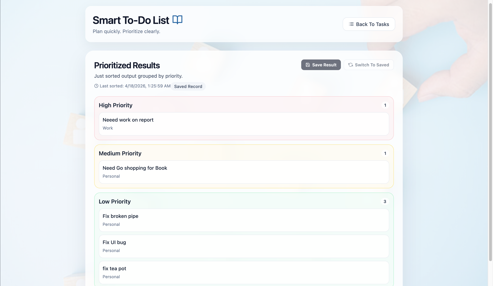

# AI Task Organizer

Smart To-Do List with AI-based prioritization.

This project is a full-stack app built with:

- Frontend: React + TypeScript + Vite + Tailwind CSS
- Backend: Node.js + Express + TypeScript
- AI: Google Gemini API (called securely from backend)

## What This App Does

- Add tasks
- Edit and delete tasks
- Send tasks to AI for sorting into High / Medium / Low priority
- Switch between task editor view and prioritized results view
- Save the latest prioritized result in localStorage
- Switch back to the saved result
- Show last sorted timestamp in results view
- Handle Gemini quota issues with backend fallback response
- Mobile responsive UI for small, medium, and desktop screens

## How App Works

1. User adds tasks in the Task Editor view.
2. Tasks are saved in browser localStorage as raw input list.
3. User clicks Prioritize Tasks.
4. Frontend sends tasks to backend using POST /prioritize.
5. Backend validates request and calls Gemini API with a strict JSON prompt.
6. Gemini returns sorted results with task, priority, and category.
7. Backend normalizes the response and sends it back to frontend.
8. Frontend displays results in the Prioritized Results view.
9. User can save latest AI result to localStorage and switch back to that saved record.
10. If Gemini quota fails, backend uses fallback sorting and still returns usable output.

## Data Flow Diagram



## Project Structure

```text
ai-task-organizer/
├── backend/
│   ├── src/
│   │   ├── middleware/
│   │   ├── routes/
│   │   ├── services/
│   │   ├── utils/
│   │   ├── config.ts
│   │   ├── errors.ts
│   │   ├── index.ts
│   │   └── types.ts
│   ├── .env.example
│   ├── package.json
│   └── tsconfig.json
├── frontend/
│   ├── src/
│   │   ├── components/
│   │   │   ├── AppHeader.tsx
│   │   │   ├── PrioritizedResultsPanel.tsx
│   │   │   └── TaskEditorPanel.tsx
│   │   ├── types/
│   │   │   └── task.ts
│   │   ├── App.tsx
│   │   ├── index.css
│   │   └── main.tsx
│   ├── .env.example
│   └── package.json
└── Screenshot/
    ├── organized_todo_by_ai.png
    └── unorganized_todos.png
```

## Screenshots

### Unorganized Tasks View



### Organized By AI View



## How To Get Gemini API Key

Use Google AI Studio:

1. Go to https://aistudio.google.com/app/api-keys
2. Click Create API key
3. Follow the setup flow
4. Copy the generated API key
5. Paste it in backend .env file as GEMINI_API_KEY

## Environment Variables

### Backend

Create this file:

- `backend/.env`

Use this content:

```env
PORT=5000
GEMINI_API_KEY=your_gemini_api_key_here
```

Reference template:

- `backend/.env.example`

### Frontend

Optional file:

- `frontend/.env`

Use this content if backend is running on default port:

```env
VITE_API_URL=http://localhost:5000
```

Reference template:

- `frontend/.env.example`

For deployed Vercel app using your current `vercel.json` service route prefix:

```env
VITE_API_URL=/_/backend
```

## How To Run Locally

Open two terminal windows.

### 1) Run backend

```bash
cd backend
npm install
npm run dev
```

Backend runs on:

- http://localhost:5000

### 2) Run frontend

```bash
cd frontend
npm install
npm run dev
```

Frontend runs on Vite default URL shown in terminal (usually http://localhost:5173).

## Build Commands

### Backend

```bash
cd backend
npm run build
```

### Frontend

```bash
cd frontend
npm run lint
npm run build
```

## API Endpoint

### POST /prioritize

Request body:

```json
{
  "tasks": [
    "Finish monthly report",
    "Buy groceries",
    "Call plumber"
  ]
}
```

Success response shape:

```json
[
  {
    "task": "Call plumber",
    "priority": "High",
    "category": "Home"
  }
]
```

## Notes

- API key is never exposed to frontend.
- If Gemini returns quota/rate-limit errors, backend includes fallback prioritization behavior.
- Raw tasks and saved latest prioritized result are stored in browser localStorage.
- The app is optimized for both desktop and mobile responsive layouts.

## Vercel Deployment Fix (localhost issue)

If deployed frontend is still calling localhost backend, check these points:

1. In Vercel Project Settings -> Environment Variables, set `VITE_API_URL` to `/_/backend`.
2. Redeploy after updating environment variables.
3. Confirm frontend build is using latest code where production fallback is `/_/backend`.
4. Hard refresh browser to clear cached frontend assets.
