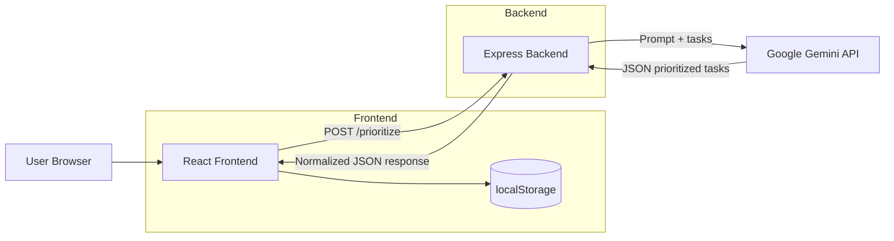
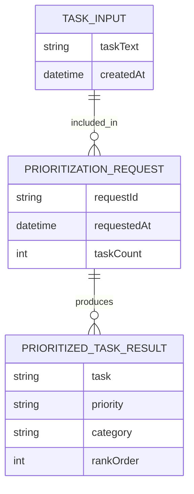

# AI-Powered Task Prioritization App

A full-stack Smart To-Do List built with React + TypeScript on the frontend and Express + TypeScript on the backend. The app sends user tasks to Google Gemini through a secure backend endpoint and displays prioritized results grouped by urgency.

## Features Implemented

- Add task input + unsorted task list
- Edit and delete tasks
- Prioritize Tasks button and backend API integration
- Prioritized results grouped by High/Medium/Low
- Loading and error states
- localStorage persistence for raw task list only
- Secure API key handling through backend environment variables

## System Architecture Diagram



## Entity Relationship Diagram (Logical)



## API Contract

### POST /prioritize

Request body:

```json
{
  "tasks": [
    "Finish the monthly report for the boss",
    "Call the plumber about the leaky faucet"
  ]
}
```

Response body:

```json
[
  {
    "task": "Call the plumber about the leaky faucet",
    "priority": "High",
    "category": "Home"
  },
  {
    "task": "Finish the monthly report for the boss",
    "priority": "High",
    "category": "Work"
  }
]
```

## Setup

### 1. Install frontend dependencies

```bash
cd frontend
npm install
```

### 2. Install backend dependencies

```bash
cd ../backend
npm install
```

### 3. Configure environment variables

Backend:
- Create or update `backend/.env`
- Required keys:
  - `PORT=5000`
  - `GEMINI_API_KEY=your_gemini_api_key`

Frontend (optional override):
- Copy `frontend/.env.example` to `frontend/.env`
- Set `VITE_API_URL` if backend is not running on `http://localhost:5000`

## Run

Start backend:

```bash
cd backend
npm run dev
```

Start frontend in another terminal:

```bash
cd frontend
npm run dev
```

## Security Notes

- API keys are used only on backend.
- Never expose AI keys in frontend source or browser requests.
- Keep `.env` files uncommitted.

## Suggested Commit Structure

- `feat(backend): add prioritize endpoint with Gemini integration`
- `feat(frontend): implement task CRUD + prioritize flow`
- `docs: add setup instructions and architecture diagrams`
